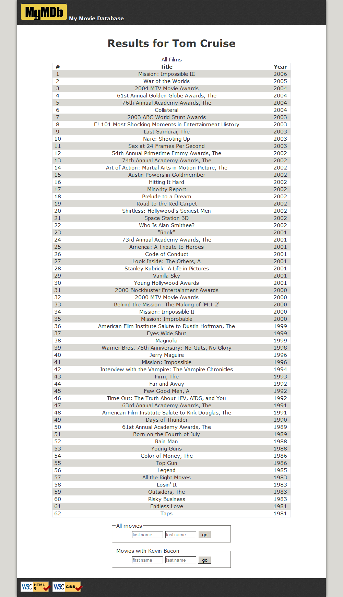
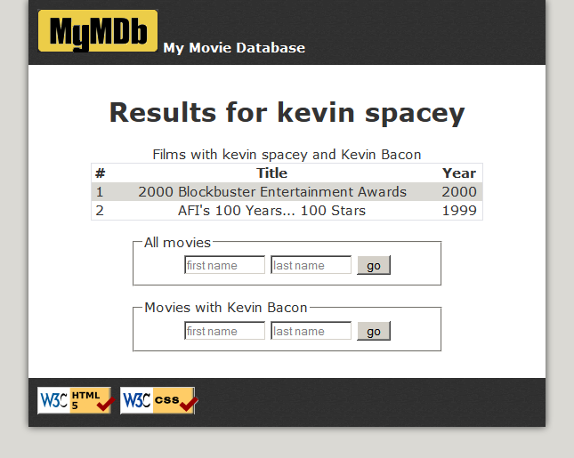

# Kevin Bacon

This assignment focuses on querying relational databases using SQL in PHP along with HTML/CSS.

## Background Information
The **Six Degrees of Kevin Bacon** is a game based upon the theory
that every actor can be connected to actor Kevin Bacon by a
chain of movies no more than 6 in length. Most, but not all, can
reach him in 6 steps. 12% of all actors cannot reach him at all.

Your task for this assignment is to write the HTML/CSS and PHP code
for a web site called **MyMDb** that mimics part of the popular
IMDb movie database site. Your site will show the movies in which
another actor has appeared with Kevin Bacon. The site will also
show a list of all movies in which the other actor has appeared.

(If you prefer, you may use another actor rather than Kevin Bacon
as the center point, so long as that actor is in our database
and has a large number of connections to other actors.)

The following files are provided:
* top.html, some common HTML that should appear at the beginning
of every page
* bottom.html, some common HTML that should appear at the end of
every page
* index.php, the initial front page that welcomes the user to the
site

The front search page index.php has two forms where the user can
type an act or's name. The user can search for every film the
actor has appeared in (which submits to **search-all.php**), or every
film where both the actor and Kevin Bacon have appeared (which
submits to **search-kevin.php**).

Here are files you must write and turn in:
* search-all.php, the page showing search results for all films by
a given actor
* search-kevin.php, the page showing search results for all films
with the given actor and Kevin Bacon
* common.php, any common code that is shared between pages
* bacon.css, the CSS styles shared by all pages

## Front Page (index.php)
The initial page, index.php, allows the user to search for actors.
This file is already provided to you; you may modify it in any way
you like, or you may leave it as-is. The forms on the page contain
two text boxes that allow the user to search for an actor by
first/last name.
* firstname for the actor's first name
* lastname for the actor's last name

## Movie Search Pages (search-all.php, search-kevin.php)
The two search pages perform queries on the imdb database to show
a given actor's movies. Query the database as taught in class.
Connect to the database using the user name, and
the MySQL password given to you.

The data in both tables should be sorted by year descending, breaking
ties by movie title ascending. The tables have three columns: A number
starting at 1; the title; and the year. The columns must have styled
headings, such as bold. The rows must have alternating background
colors, called "zebra striping."

## Database and Queries
The database has the following relevant tables. (The roles table connects actors to movies.)

| table      | columns |
| ----------- | ----------- |
| actors      | id, first_name, last_name, gender, film_count       |
| movies   | id, name, year        |
| roles | actor_id, movie_id, role |

Your search pages perform the following queries. For some queries,
you must use a join on several database tables.
1. **search-all.php - List of all the actor's movies**: A query to
find a complete list of movies in which the actor has
performed, showing them in an HTML table. If the actor doesn't
exist in the database, don't show a table, and
instead show a message such as, "Actor Borat Sagdiyev not found."
If the actor is found in the database, you may
assume that any actor in the actors table has been in at least
one movie.

Hint: To find the proper query, you will need to join all three
of actors, movies, and roles. Retain only the rows
where the relevant IDs from the tables match each other, and
also retain only the rows that pertain to your particular
actor. Our solution joins 3 tables in the FROM clause and has
one test in its WHERE clause.

2. **search-kevin.php - List of movies with this actor and Kevin Bacon**:
A query to find all movies in which the
actor performed with Kevin Bacon. These movies should be
displayed as a second HTML table, with the same
styling as the first. This is the harder query and should
be done last. If the actor doesn't exist in the database,
don't show a table, and instead show a message such as,
"Actor Borat Sagdiyev not found." If the actor has not been in
any movies with Kevin Bacon, don't show a table, and instead
show a message such as, "Borat Sagdiyev wasn't in any
films with Kevin Bacon."

This query is bigger and tougher because you must locate a pair of performances, one by the submitted actor and
one by Kevin Bacon, that both occurred in the same film.

Hint: You must join a pair of actors (yours and Bacon), a pair of
roles that match those actors, and a movie that
matches those two roles. Our query joins 5 tables in the FROM
clause and contains 3 conditions in its WHERE clause.

3. **both pages - Find the ID for a given actor's name**:
One thing that makes this program more complicated is
the fact that some actors share the same name. The imdb data resolves
this by giving them slightly different first
names, such as "Will (I) Smith" vs. "Will (II) Smith". The user
presumably doesn't know or understand this, so they
will just type "Will Smith" and expect the program to do the
right thing. But if your code naively searches for "Will
Smith" in the database, it will not find any match.
To resolve this, you need a third query that searches for the
best match for the actor's name that was typed by the
user. This query finds and return the ID of the actor whose
last name exactly matches what was typed by the user,
and whose first name starts with the text typed by the user.
If more than one such actor exists, you use the actor
who has appeared in the most movies, breaking ties by choosing
the actor with the lower-numbered ID.

You could figure out how many movies an actor has appeared in
using a series of joins between tables, but this can
be hard to get right and can be slow. To help, we have created
a column in the actors table named film_count that
contains the total number of roles played in all films
by the actor. You can use this column to help write your query.

For example, if you have written this query correctly and
searched the larger imdb database for "Will Smith", you
would produce the actor ID 444807. For "David Cohen" you would
produce the ID of 90749. For "Elizabeth
Taylor" you'd produce 809516.

Hint: You don't need any JOINs here because all information
comes from the actors table. If you don't want to
write this query right away, you could temporarily hard-code
an actor's ID or just write a query to return the first
actor with a given first/last name, which is what the correct
query would do anyway when there are no conflicts.

The behavior of the page is undefined if the actor being
searched for is Kevin Bacon himself.
